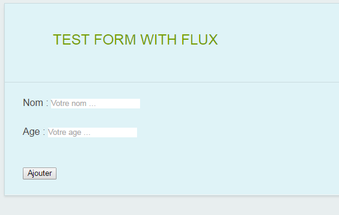

# formationMaroc-FrontReactFlux
Formation Maroc Front React & Flux

# TODO
- Dynamiser le formulaire de test (via 'flux') pour les données 'name' et 'age' de l'objet 'person'
- Mettre à jour les actions qui appellent le store
- Metter à jour le store
- Penser aux props à passer au composant (ici pad d'etat !) : cf. alert React sur console ...
- Ajouter la personne du formulaire dans une liste de personnes (une props)
- Encore du temps : afficher la liste des personnes ajoutées sous le formulaire (ul et li par exemple)
- Présentation d'abyssa

Voir MyForm.js.

Proxy git si problème :
```
[http]
	proxy = http://128.129.194.1:8080
[https]
	proxy = http://128.129.194.1:8080
```

# react version
```
0.14.0
```
# flux implementation
[https://github.com/AlexGalays/fluxx](https://github.com/AlexGalays/fluxx "https://github.com/AlexGalays/fluxx")

# install
```
npm install
```

# dependencies
```
"dependencies": {
    "abyssa": "7.0.1",
    "fluxx": "0.4.0",
    "lodash": "3.9.1",
    "moment": "2.10.6",
    "normalize-css": "2.3.1",
    "numeral": "1.5.3",
    "q": "1.4.0",
    "qajax": "1.3.0",
    "react": "0.14.0",
    "react-dom": "0.14.0"
  }
```

# build
Stylus :
```
npm run build-stylus
```

JS :
```
npm run build-js
```

# watch
Stylus :
```
npm run watch-stylus
```

JS :
```
npm run watch-js
```

HTML



